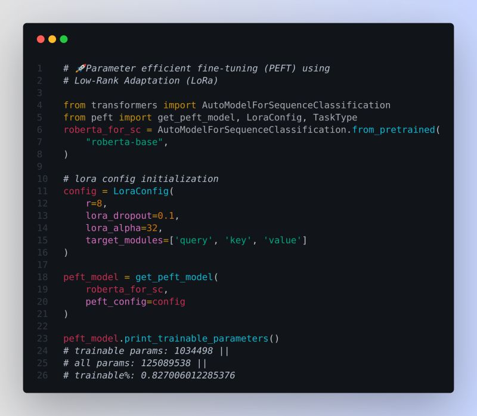

# [Finetuning Methods in LLM and Explanation](https://abvijaykumar.medium.com/fine-tuning-llm-parameter-efficient-fine-tuning-peft-lora-qlora-part-1-571a472612c4)

## LoRA Fine-Tuning Method

## Overview

Welcome to the README for LoRA (Low-Rank Adaptation) fine-tuning method. LoRA offers a novel approach to fine-tuning neural network models, particularly beneficial for reducing parameter count while maintaining performance. This README aims to provide a comprehensive understanding of LoRA and its associated parameters.

## LoRA Concept

In LoRA, fine-tuning involves adapting the original weight matrix \( W \) by adding a low-rank product of two smaller matrices \( B \) and \( A \), denoted as \( BA \). The adapted weight matrix becomes \( W' = W_0 + BA \), where \( W_0 \) remains static during fine-tuning. This process significantly reduces the trainable parameter count while preserving model performance.

## Parameter Overview

### Rank of Decomposition (\( r \))

The rank of decomposition \( r \) represents the dimensionality of the low-rank matrices learned during fine-tuning. It directly impacts the trade-off between computational intensity and performance. A lower \( r \) may lead to less computationally intensive training but might sacrifice some performance. The default value for \( r \) is 8.

### Alpha Parameter for LoRA Scaling (`lora_alpha`)

The scaling factor \( \alpha \) influences the magnitude of weight updates during fine-tuning. Specifically, \( \Delta W \) is scaled by \( \frac{\alpha}{r} \), where \( \alpha \) is a constant. Tuning \( \alpha \) is akin to tuning the learning rate, particularly when using Adam optimizer.

### Bias (`bias`)

The `bias` parameter determines which biases are updated during training. Options include:
- `none`: No biases are updated.
- `all`: All biases are updated.
- `lora_only`: Only biases corresponding to LoRA-adapted weights are updated. The default is `none`.

### Task Type (`task_type`)

The `task_type` parameter specifies the type of task for fine-tuning. Options include:
- `CAUSAL_LM`
- `FEATURE_EXTRACTION`
- `QUESTION_ANS`
- `SEQ_2_SEQ_LM`
- `SEQ_CLS`
- `TOKEN_CLS`

## Visual Representation

For a visual representation of the LoRA fine-tuning process, refer to the included image `LoRA.jpg`.

## Examples

Consider the following scenarios where LoRA fine-tuning might be advantageous:
- When fine-tuning large pre-trained models with limited computational resources.
- When aiming to reduce overfitting in fine-tuning tasks with limited labeled data.

## References

For more detailed information, refer to the original LoRA paper or relevant literature.

---

